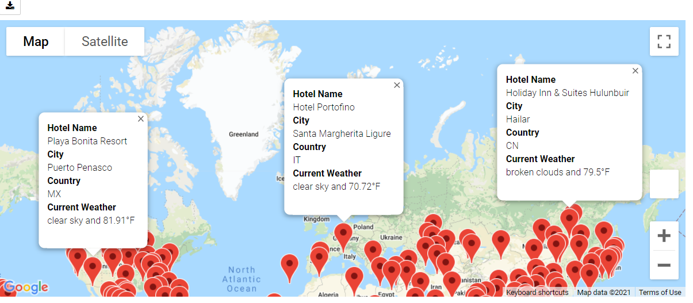

# World_Weather_Analysis
Perform analysis on the weather data collected through API

## Purpose and Overview of the project

1. The purpose of this project is to collect data from various APIs for the Plan my Trip app, so that customers can choose their ideal place of vacation based on their
   weather preferences.

2. Web APIS allows us to request data from a website or a database server in various formats. In this project we have retrieved our weather data in JSON format.

3. With the help of various modules like citipy module in python we generated random cities all around the world and then using weather APIs we have collected the 
   required weather parameters for those cities like the maximum temperature, humidity, wind speed etc. The data collected is as below:
   
   [WeatherPy_Database](./Weather_Database/WeatherPy_Database.csv)
   
   
4. Based on the temperature preferences of the customer we have retrieved the information about the nearby hotels through google maps API as shown below. We have also added the
   popup markers for their easy access using the gmaps.
   
  [WeatherPy_vacation](./Vacation_Search/WeatherPy_vacation.csv)

    
 
 
 5. Also the customers can create their travel itinerary for some of the cities they wish to travel. We have created a map to showcase their travel itinerary using gmaps.
   For this we have used direction layer map function of the gmaps for their travel routes through driving.We have also added markers for each location as shown below:
   
     